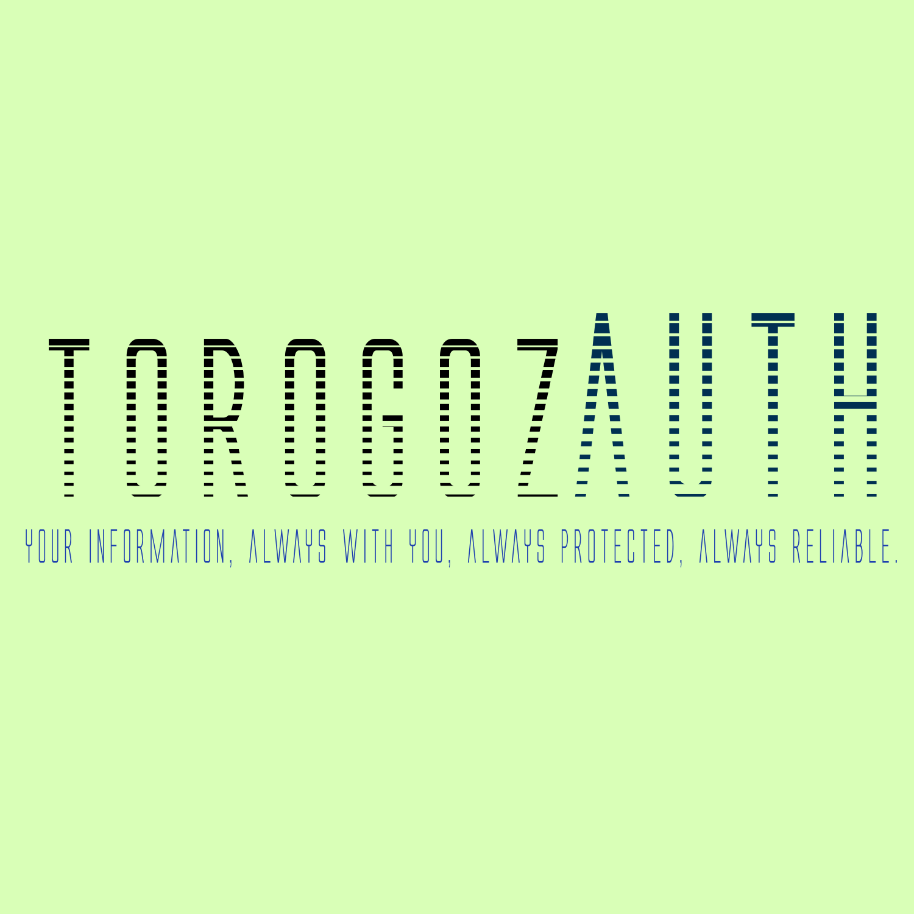

# TorogozAuth

       


  


# Torogoz-Auth

A secure, scalable, and modern authentication system designed for blockchain and Web3-based projects.

## Key Features

- Secure authentication implementation.
- Integration with blockchain technologies.
- Compatible with traditional systems and dApps.

---

## Table of Contents

1. [Description](#description)  
2. [Installation](#installation)  
3. [Usage](#usage)  
4. [Project Structure](#project-structure)  
5. [Contributions](#contributions)  
6. [License](#license)  
7. [Contact](#contact)  

---

## Description

Torogoz-Auth is an authentication system designed for modern applications that require a secure and decentralized approach. This project is ideal for developers looking to integrate robust authentication into their blockchain or traditional projects.

---

## Installation

### Prerequisites

- Node.js (v16 or higher)  
- npm or yarn  
- A developer account on supported services  

### Installation Steps

1. Clone the repository:

   ```bash
   git clone https://github.com/Chinaskidev/Torogoz-Auth.git  
   cd Torogoz-Auth
   ```

2. Install dependencies:

   ```bash
   npm install
   ```

3. Set up environment variables:

   - Rename the `.env.example` file to `.env`.
   - Fill in the required values in the `.env` file.

4. Start the server:

   ```bash
   npm start
   ```

---

## Usage

### 1. Traditional Authentication:

Register a user with:

```bash
curl -X POST http://localhost:3000/register -d '{"username":"user","password":"pass"}'
```

### 2. Blockchain Authentication:

Set up your compatible wallet and authenticate.

---

## Project Structure

```plaintext
Torogoz-Auth/  
├── src/  
│   ├── app/              # Authentication logic  
│   ├── (landingpages)/   # Implements the main pages of the application  
│   ├── dashboard/        # Manages the configuration of variables, services and customized display  
│   └── utils/            # Shared utilities  
├── tests/                # Unit and integration tests  
├── .env.example          # Example environment variables  
├── package.json          # Dependencies and scripts  
└── README.md             # Project documentation  
```

---

## Contributions

Contributions are welcome!

1. Fork the repository.

2. Create a branch for your feature:

   ```bash
   git checkout -b feature/new-feature
   ```

3. Make your changes and submit a Pull Request.

Please review our contribution guidelines before getting started.

---

## License

This project is licensed under the MIT License. See the `LICENSE` file for more details.

---

## Contact

**Author:** Chinaskidev  
**Email:** torogozauth@gmail.com


